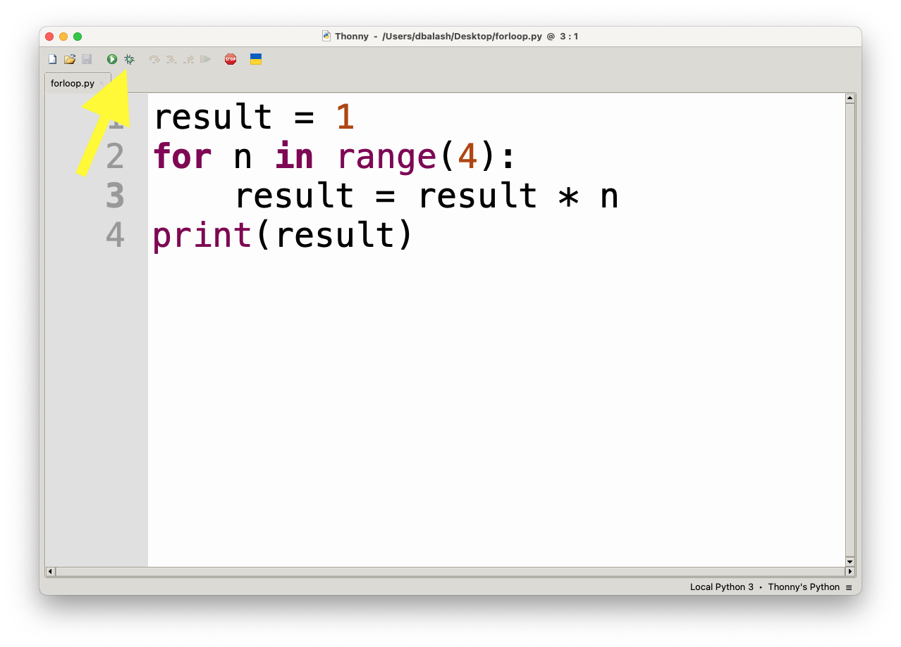
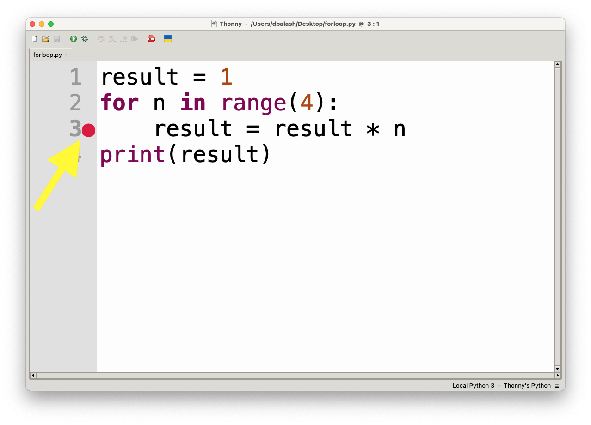
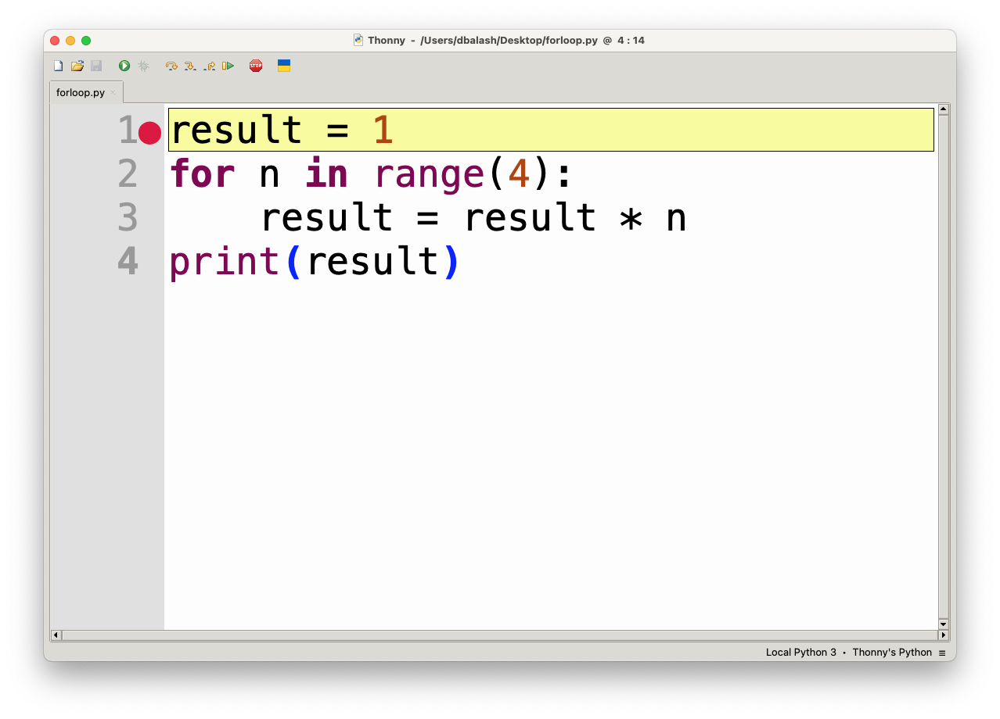
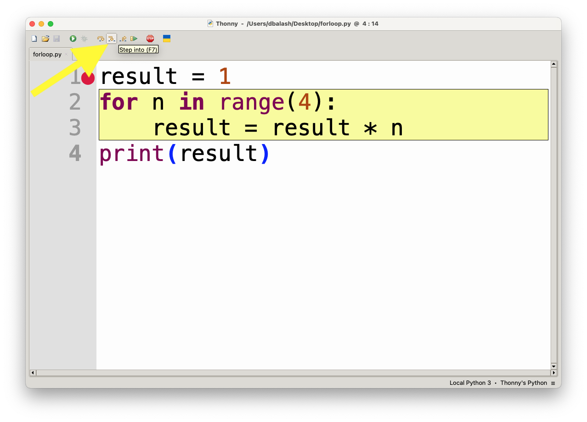
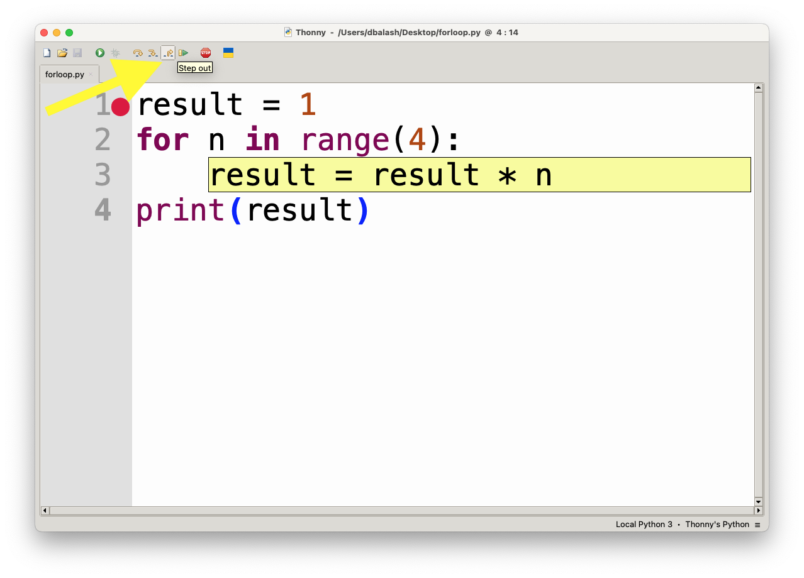
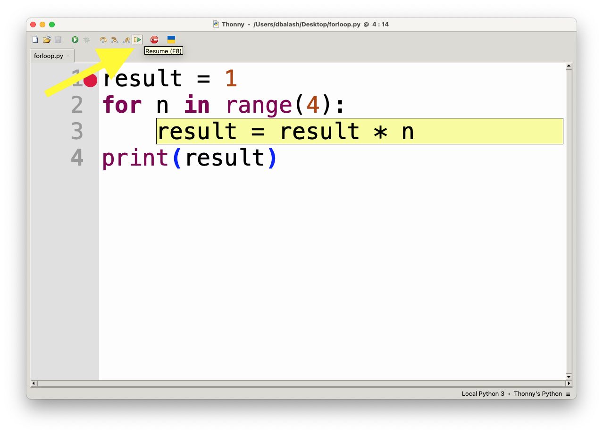
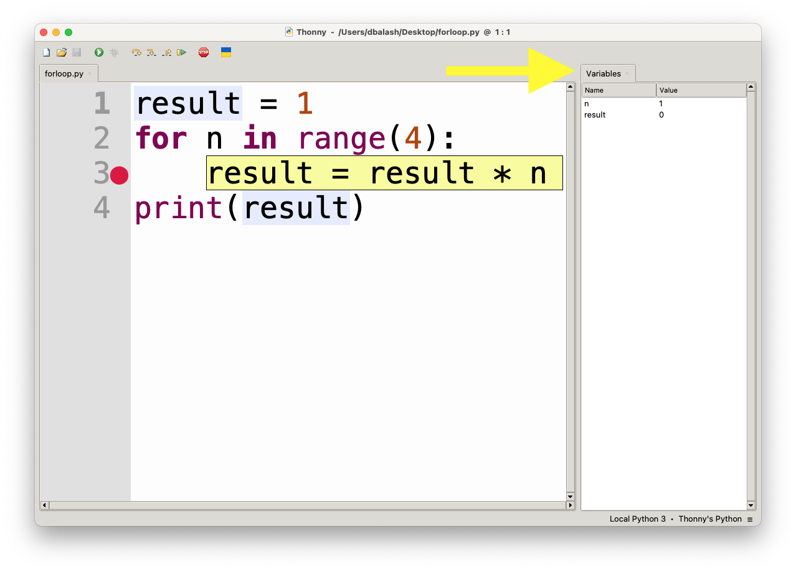

# Thonny IDE Debugger Guide

Thonny is an integrated development environment (IDE) designed for beginners to learn Python. One of its most powerful features is the built-in debugger, which allows you to step through your code and inspect variables to better understand how your program runs. Here's a guide to using the debugger in Thonny.

## **Opening the Debugger**

To start using the debugger, follow these steps:
- Open your Python file in Thonny.
- Click on the **Debug** button in the toolbar (it looks like a beetle) or press **Ctrl+F5** (on Windows/Linux) or **Cmd+F5** (on macOS).
- Alternatively, go to the menu bar and select **Run > Debug Current Script**.

## **Setting Breakpoints**

Breakpoints tell the debugger where to pause the program, allowing you to inspect the state of the program at that point.

- To set a breakpoint, click to the left of the line number in the code editor where you want the program to pause. A red dot will appear, indicating a breakpoint.
- To remove the breakpoint, click on the red dot again.
  
Thonny will pause execution when it reaches the line with the breakpoint.

## **Running in Debug Mode**

After setting breakpoints, follow these steps to run your program in debug mode:
- Press **Ctrl+F5** (or **Cmd+F5** for macOS) or click the beetle icon in the toolbar.
- The program will start running and will pause at the first breakpoint you set.

## **Stepping Through Code**

Once the program is paused, you can control the flow of execution using the following controls:

- **Step Over (F6)**: Executes the current line of code. If the current line contains a function call, it will execute the whole function without stepping into it.

- **Step Into (F7)**: If the current line contains a function call, this will step into the function and allow you to debug it line by line.

- **Step Out (Shift+F7)**: If you are inside a function, this command will execute the rest of the function and bring you back to the calling code.

- **Continue (F5)**: This will resume execution until the next breakpoint is reached or the program finishes.

## **Inspecting Variables**

While debugging, Thonny provides a **Variables** window where you can see the current values of variables.

- The **Variables** pane is located on the right side of the window. It displays the values of all variables in the current scope (local and global).
- You can track how variables change as you step through your code, which is very helpful for identifying bugs or understanding logic flow.

## **Call Stack**

Thonny also shows the **Call Stack**, which is located in the lower-right corner of the debugger window.

- The **Call Stack** window displays the list of function calls that have been made so far, showing you which function the program is currently in and how the program got there.
- This is useful for understanding the flow of a program, especially when working with recursive functions or functions that call other functions.

## **Debugging Tips**

- **Step-by-Step Execution**: Always start with **Step Over** to move line by line and observe the code execution, especially when you’re unsure where the problem is.
- **Use Breakpoints Wisely**: Set breakpoints in areas where you think the problem might occur. This will save you from stepping through every line of code unnecessarily.
- **Watch Variables**: Pay attention to how variable values change as you step through the code. Incorrect variable values can indicate bugs.
- **Check the Call Stack**: If you are dealing with function calls, use the call stack to understand how the execution reached a particular point.

---

Thonny's debugger is easy to use, yet powerful enough to help you understand your code's flow, making it an excellent tool for Python learners. 
