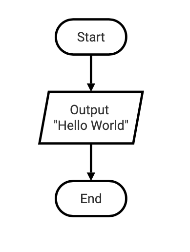
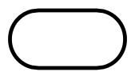
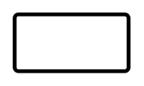
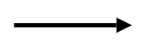
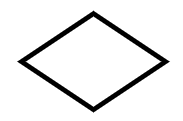
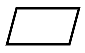
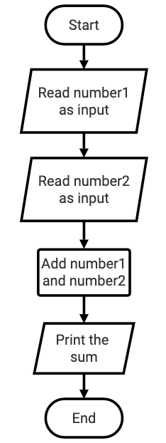
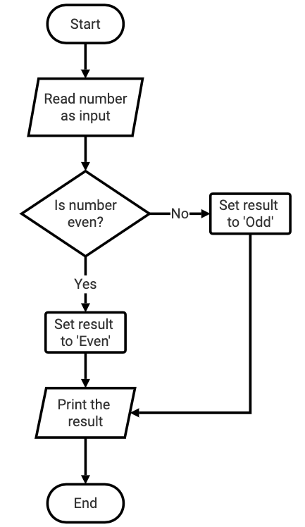

# Flowchart Guide

A __flowchart__ can be used to _visually represent_ an algorithm or program.

What do you think will happen when this flowchart is _executed_ as a Python _program_?




The code will output "Hello World" in the terminal for the user.

Flowcharts represent code:
* __Flowcharts__ are used when _designing_ programs.

* They should be clear and precise, just like your code.

* Flowcharts are read from _top to bottom_.

## Flowchart Shapes

Here are the five most common shapes used in a __flowchart__:

* __Oval__ (Terminal symbol)
* __Rectangle__ (Process symbol)
* __Arrow__ (Arrow Symbol)
* __Diamond__ (Decision symbol)
* __Parallelogram__ (Input/Output symbol)


<table style='border-left: 1px solid #dedede; border-top: 1px solid #dedede;'>
    <tr style='border-right: 1px solid #dedede;'>
        <td style='text-align: center; border-right: 1px solid #dedede;'><b>Symbol</b></td>
        <td style='text-align: center; border-right: 1px solid #dedede;'><b>Name</b></td>
        <td style='text-align: center; border-right: 1px solid #dedede;'><b>Function</b></td>
    </tr>
    <tr style='border-right: 1px solid #dedede;'>
        <td style='border-right: 1px solid #dedede;'></td>
        <td style='text-align: center; border-right: 1px solid #dedede;'>Oval</td>
        <td style='border-right: 1px solid #dedede;'>Represents the start or end of a process</td>
    </tr>
    <tr style='border-right: 1px solid #dedede;'>
        <td style='border-right: 1px solid #dedede;'></td>
        <td style='text-align: center; border-right: 1px solid #dedede;'>Rectangle</td>
        <td style='border-right: 1px solid #dedede;'>Denotes a process or operation step</td>
    </tr>
    <tr style='border-right: 1px solid #dedede;'>
        <td style='border-right: 1px solid #dedede;'></td>
        <td style='text-align: center; border-right: 1px solid #dedede;'>Arrow</td>
        <td style='border-right: 1px solid #dedede;'>Indicates the flow between steps</td>
    </tr>
    <tr style='border-right: 1px solid #dedede;'>
        <td style='border-right: 1px solid #dedede;'></td>
        <td style='text-align: center; border-right: 1px solid #dedede;'>Diamond</td>
        <td style='border-right: 1px solid #dedede;'>A point requiring a yes/no decision</td>
    </tr>    
    <tr style='border-right: 1px solid #dedede; border-bottom: 1px solid #dedede;'>
        <td style='border-right: 1px solid #dedede;'></td>
        <td style='text-align: center; border-right: 1px solid #dedede;'>Parallelogram</td>
        <td style='border-right: 1px solid #dedede;'>Used for input or output operations</td>
    </tr>
</table>

<br />


## Examples

### Example 1

Design a program that calculates the sum of two numbers. It reads (takes as input) two numbers and displays the sum.





Now write the program based on the design in the flowchart.

```python
number1 = eval(input("Enter number 1: "))  # Asks users to input number 1
number2 = eval(input("Enter number 2: "))  # Asks users to input number 2

# Calculate the sum of the two numbers
add_result = number1 + number2

# Print the results
print("Sum of two numbers is", add_result)
```

### Example 2

Design a program that determines if a number is even or odd. It reads (takes as input) one number and displays the string 'Even' if the number is even, otherwise it displays 'Odd' if the number is odd.  




Now write the program based on the design in the flowchart.

```python
number = eval(input("Enter a number: "))  # Ask the user to input a number

# Calculate the sum of the two numbers
if number % 2 == 0:
    result = "Even"
else:
    result = "Odd"

# Print the result
print(result)
```