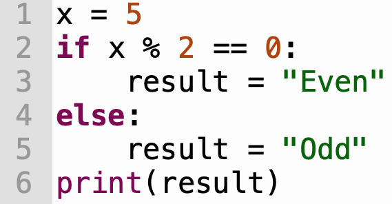

# Tracing Guide

The ability to trace your code is essential for debugging. Given some arbitrary Python code, you should always be able to answer the questions:

* What line gets executed next?
* What is the current _state_ of memory? In other words, which values are currently assigned to which variables?

 

## Instructions
Trace the execution of a program by filling in the a tracing table.

1. In __Step__, number the step of execution.
2. In __Memory State__, show the values of all variables currently in memory _after_ the line has executed, e.g., `x: 5`
3. In __Next Line__, write down the next line of code that will execute, e.g., 2.
4. In __Output__, write down any text if any, that will be printed.

### Tracing table:

<table style='border-left: 1px solid #dedede; border-top: 1px solid #dedede;'>
    <tr style='border-right: 1px solid #dedede;'>
        <td style='text-align: center; border-right: 1px solid #dedede;'><b>Step</b></td>
        <td style='text-align: center; border-right: 1px solid #dedede;'><b>Memory State</b></td>
        <td style='text-align: center; border-right: 1px solid #dedede;'><b>Next Line</b></td>
        <td style='text-align: center; border-right: 1px solid #dedede;'><b>&nbsp;&nbsp;&nbsp;&nbsp;&nbsp;&nbsp;&nbsp;&nbsp;&nbsp;Output&nbsp;&nbsp;&nbsp;&nbsp;&nbsp;&nbsp;&nbsp;&nbsp;&nbsp;</b></td>
    </tr>
    <tr style='border-right: 1px solid #dedede;'>
        <td style='border-right: 1px solid #dedede;'>&nbsp;</td>
        <td style='border-right: 1px solid #dedede;'>&nbsp;</td>
        <td style='border-right: 1px solid #dedede;'>&nbsp;</td>
        <td style='border-right: 1px solid #dedede;'>&nbsp;</td>
    </tr>
    <tr style='border-right: 1px solid #dedede;'>
        <td style='border-right: 1px solid #dedede;'>&nbsp;</td>
        <td style='border-right: 1px solid #dedede;'>&nbsp;</td>
        <td style='border-right: 1px solid #dedede;'>&nbsp;</td>
        <td style='border-right: 1px solid #dedede;'>&nbsp;</td>
    </tr>
    <tr style='border-right: 1px solid #dedede;'>
        <td style='border-right: 1px solid #dedede;'>&nbsp;</td>
        <td style='border-right: 1px solid #dedede;'>&nbsp;</td>
        <td style='border-right: 1px solid #dedede;'>&nbsp;</td>
        <td style='border-right: 1px solid #dedede;'>&nbsp;</td>
    </tr>
    <tr style='border-right: 1px solid #dedede; border-bottom: 1px solid #dedede;'>
        <td style='border-right: 1px solid #dedede;'>&nbsp;</td>
        <td style='border-right: 1px solid #dedede;'>&nbsp;</td>
        <td style='border-right: 1px solid #dedede;'>&nbsp;</td>
        <td style='border-right: 1px solid #dedede;'>&nbsp;</td>
    </tr>
</table>

 
 
 

## Example 1

<table style='border-left: 1px solid #dedede; border-top: 1px solid #dedede;'>
    <tr style='border-right: 1px solid #dedede;'>
        <td style='text-align: center; border-right: 1px solid #dedede;'><b>Step</b></td>
        <td style='text-align: center; border-right: 1px solid #dedede;'><b>Memory State</b></td>
        <td style='text-align: center; border-right: 1px solid #dedede;'><b>Next Line</b></td>
        <td style='text-align: center; border-right: 1px solid #dedede;'><b>Output</b></td>
    </tr>
    <tr style='border-right: 1px solid #dedede;'>
        <td style='border-right: 1px solid #dedede;'>1</td>
        <td style='border-right: 1px solid #dedede;'>x: 5</td>
        <td style='border-right: 1px solid #dedede;'>2</td>
        <td style='border-right: 1px solid #dedede;'>&nbsp;</td>
    </tr>
    <tr style='border-right: 1px solid #dedede;'>
        <td style='border-right: 1px solid #dedede;'>2</td>
        <td style='border-right: 1px solid #dedede;'>x: 5, y: 10</td>
        <td style='border-right: 1px solid #dedede;'>3</td>
        <td style='border-right: 1px solid #dedede;'>&nbsp;</td>
    </tr>
    <tr style='border-right: 1px solid #dedede;'>
        <td style='border-right: 1px solid #dedede;'>3</td>
        <td style='border-right: 1px solid #dedede;'>x: 5, y: 10, sum: 15</td>
        <td style='border-right: 1px solid #dedede;'>4</td>
        <td style='border-right: 1px solid #dedede;'>&nbsp;</td>
    </tr>
    <tr style='border-right: 1px solid #dedede; border-bottom: 1px solid #dedede;'>
        <td style='border-right: 1px solid #dedede;'>4</td>
        <td style='border-right: 1px solid #dedede;'>x: 5, y: 10, sum: 15</td>
        <td style='border-right: 1px solid #dedede;'>Done</td>
        <td style='border-right: 1px solid #dedede;'>The sum is 15</td>
    </tr>
</table>

 
 
 

## Example 2

<table style='border-left: 1px solid #dedede; border-top: 1px solid #dedede;'>
    <tr style='border-right: 1px solid #dedede;'>
        <td style='text-align: center; border-right: 1px solid #dedede;'><b>Step</b></td>
        <td style='text-align: center; border-right: 1px solid #dedede;'><b>Memory State</b></td>
        <td style='text-align: center; border-right: 1px solid #dedede;'><b>Next Line</b></td>
        <td style='text-align: center; border-right: 1px solid #dedede;'><b>Output</b></td>
    </tr>
    <tr style='border-right: 1px solid #dedede;'>
        <td style='border-right: 1px solid #dedede;'>1</td>
        <td style='border-right: 1px solid #dedede;'>x: 5</td>
        <td style='border-right: 1px solid #dedede;'>2</td>
        <td style='border-right: 1px solid #dedede;'>&nbsp;</td>
    </tr>
    <tr style='border-right: 1px solid #dedede;'>
        <td style='border-right: 1px solid #dedede;'>2</td>
        <td style='border-right: 1px solid #dedede;'>x: 5</td>
        <td style='border-right: 1px solid #dedede;'>4</td>
        <td style='border-right: 1px solid #dedede;'>&nbsp;</td>
    </tr>
    <tr style='border-right: 1px solid #dedede;'>
        <td style='border-right: 1px solid #dedede;'>3</td>
        <td style='border-right: 1px solid #dedede;'>x: 5</td>
        <td style='border-right: 1px solid #dedede;'>5</td>
        <td style='border-right: 1px solid #dedede;'>&nbsp;</td>
    </tr>
    <tr style='border-right: 1px solid #dedede;'>
        <td style='border-right: 1px solid #dedede;'>4</td>
        <td style='border-right: 1px solid #dedede;'>x: 5, result = "Odd"</td>
        <td style='border-right: 1px solid #dedede;'>6</td>
        <td style='border-right: 1px solid #dedede;'>&nbsp;</td>
    </tr>
    <tr style='border-right: 1px solid #dedede; border-bottom: 1px solid #dedede;'>
        <td style='border-right: 1px solid #dedede;'>5</td>
        <td style='border-right: 1px solid #dedede;'>x: 5, result = "Odd"</td>
        <td style='border-right: 1px solid #dedede;'>Done</td>
        <td style='border-right: 1px solid #dedede;'>Odd</td>
    </tr>
</table>

 
 

---

