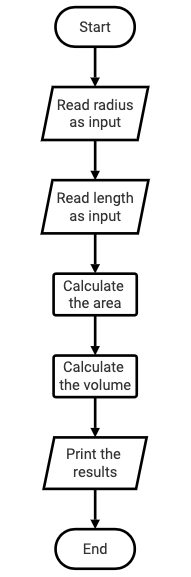
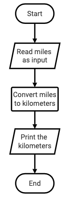
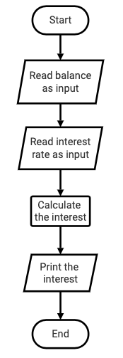
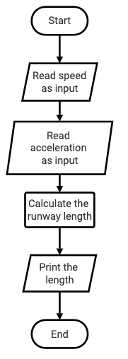

# Lab 2: Flowcharts, Programming, and Tracing


## Program 1: Compute the volume of a cylinder



**cylinder.py**
```python
''' 
Author name: <Your name here>
This program calculates the area and volume of a cylinder 
based on the radius and length input by the user.
'''

# Set a variable that will hold the value of pi
PI = 3.14159

# Ask the user to enter a value for the radius
radius = eval(input("Enter a radius: "))  

# Ask the user to enter a value for the length
length = eval(input("Enter a length: "))  

# Calculate the area of the cylinder using the formula radius * radius * PI
area = radius * radius * PI

# Calculate the volume of the cylinder using the formula area * length
volume = area * length

# Print the results
print("The area of the cylinder is", area, "the volume is", volume)

```


## Program 2: Miles to kilometers



**m2k.py**
```python
''' 
Author name: <Your name here>
This program converts miles to kilometers.
'''

# Set a variable that will hold the value one mile in kilometers
ONE_MILE_IN_KILOMETERS = 1.609

# Ask the user to enter a value for the miles
miles = eval(input("Enter miles: "))  

# Convert to kilometers
kilometers = miles * ONE_MILE_IN_KILOMETERS

# Print the results
print(miles, "miles is", kilometers, "kilometers")

```


## Program 3: Financial application: calculate interest



**finance.py**
```python
''' 
Author name: <Your name here>
This program calculates interest.
'''

# Ask the user to enter a their balance
balance = eval(input("Enter current balance: "))  

# Ask the user to enter a their balance
annual_interest_rate = eval(input("Enter the annual interest rate: "))  

# Calculate the interest using the formula
interest = balance * (annual_interest_rate / 1200)

# Print the results
print("Next month's interests is", round(interest, 2))

```


## Program 4: Physics - find runway length



**physics.py**
```python
''' 
Author name: <Your name here>
This program computes the minimum runway length needed
for an airplane to takeoff.
'''

# Ask the user to enter the current speed
velocity = eval(input("Enter current speed: "))  

# Ask the user to enter the acceleration
acceleration = eval(input("Enter the acceleration: "))  

# Calculate the minimum runway length
minimum_runway_length = (velocity ** 2) / (2 * acceleration)

# Print the results
print("The minimum runway length is", minimum_runway_length)

```


## Grading Rubric for each of the programs:

<table>
    <tr>
        <td>Grading</td>
        <td>Points Possible</td>
    </tr>
    <tr>
        <td>Appropriate header and comments</td>
        <td>5</td>
    </tr>
    <tr>
        <td>Input</td>
        <td>2</td>
    </tr>
    <tr>
        <td>Flowchart</td>
        <td>3</td>
    </tr>
    <tr>
        <td>Computation</td>
        <td>5</td>
    </tr>
    <tr>
        <td>Print output</td>
        <td>5</td>
    </tr>
    <tr>
        <td>Tracing</td>
        <td>5</td>
    </tr>
</table>

**TOTAL	25 points for each program**

---