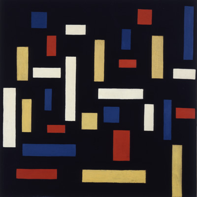

# Lab 7: Turtle Graphics
 

__Points Possible:__ 100

__Due:__ Thursday, October 17th

In this lab, we will write programs using turtle graphics.

Submission:
1.	Submit a Python file for the program.


# De Stijl Art Movement

## Overview

**De Stijl** (Dutch for "The Style") was an influential modern art movement founded in 1917 in the Netherlands. It is known for its abstract, minimalist style that emphasized vertical and horizontal lines, rectangular forms, and the use of primary colors (red, blue, yellow) alongside black, white, and gray.

### Key Characteristics:
- **Simplicity and Abstraction**: De Stijl artists rejected naturalistic representations and focused on the pure essence of form and color.
- **Geometric Shapes**: The movement emphasized geometric shapes such as rectangles and squares.
- **Primary Colors**: Artists used a limited palette of primary colors (red, blue, yellow) and non-colors (black, white, gray).
- **Balance and Harmony**: De Stijl sought to create a universal visual language of balance and harmony through its abstraction.

## Piet Mondrian (1872–1944)

One of the most famous figures associated with De Stijl, **Piet Mondrian** is best known for his iconic grid-based paintings featuring bold black lines, white spaces, and blocks of primary colors. His work is a hallmark of De Stijl and abstract art.

Mondrian believed in a form of **Neo-Plasticism** ("new art") that emphasized the reduction of art to its most basic elements—color, line, and form. His works evolved from representational landscapes to purely abstract compositions, in which he used only straight lines and primary colors to represent the harmony of the universe.

### Example of Mondrian’s Work:


*Composition II in Red, Blue, and Yellow* (1930) by Piet Mondrian

### Mondrian’s Contributions:
- Developed a unique artistic vocabulary based on straight lines and right angles.
- Explored the relationship between form and space.
- Advocated for art as a means to convey deeper universal truths about harmony and order.

---

## Theo van Doesburg (1883–1931)

**Theo van Doesburg** was the founder of the De Stijl movement and an artist, architect, and theorist. He was a prolific advocate for the movement and its principles, working across different media, including painting, typography, and architecture.

Unlike Mondrian, who maintained strict adherence to vertical and horizontal lines, van Doesburg experimented with **diagonal lines** in his later work. This caused a split between him and Mondrian, but van Doesburg remained an influential figure within the movement.

### Example of van Doesburg’s Work:


*Counter-Composition VI* (1925) by Theo van Doesburg

### Van Doesburg’s Contributions:
- Founded and edited the **De Stijl** journal, which disseminated the ideas of the movement.
- Worked in a variety of disciplines, including architecture and design, in addition to painting.
- Advocated for the integration of De Stijl principles in all aspects of life, from art to architecture and furniture design.

---

## Legacy of De Stijl

Although the De Stijl movement lasted only until the early 1930s, it had a lasting impact on modern art, architecture, and design. Its principles of abstraction, simplification, and the use of basic geometric forms influenced later art movements like **Bauhaus**, **Minimalism**, and **Abstract Expressionism**. De Stijl's ideas continue to inspire architects, designers, and artists today.

---

### Conclusion

The De Stijl movement was a radical and influential force in 20th-century art, led by figures like Piet Mondrian and Theo van Doesburg. Its emphasis on abstraction, simplicity, and harmony left a lasting imprint on both art and design, with Mondrian’s grid-based paintings and van Doesburg’s diagonal compositions standing as iconic examples of the movement’s aesthetic.

By studying De Stijl, students can gain a deeper appreciation of how art movements can influence modern aesthetics, from architecture to digital design.


# Lab Assignment: Create Your Own De Stijl-Inspired Art Using Python Turtle Graphics

In this lab assignment, you will use **Turtle Graphics** to create an abstract artwork inspired by the **De Stijl** art movement. The design should reflect the minimalist, geometric style that characterizes the movement, including:
- Straight lines
- Rectangular shapes
- A limited color palette of **primary colors** (red, blue, yellow) and **non-colors** (black, white, gray)

The final piece will consist of a grid of rectangles of varying sizes, with some filled with color and others left blank or outlined.

**Note:** Use the [Turtle Graphics Guide](https://cmsc105-f24.github.io/guides/turtle) on the class website for help with the turtle commands.

## Submission Details

Save your file as `art.py` and add this file the Lab 7 assignment on Blackboard.

---

## **Skills Involved**:
- Drawing rectangles and lines
- Filling shapes with specific colors
- Creating geometric patterns with Turtle Graphics
- Using loops and functions to simplify repetitive drawing tasks
- Structuring code for artistic variety

---

## **Challenge Description**:

You will create a **De Stijl-inspired composition** by drawing a grid of different sized rectangles. Some rectangles will be filled with primary colors (red, blue, yellow), while others will remain white or outlined in black. The composition should emphasize simplicity, abstraction, and harmony, key principles of the De Stijl movement.

---

## **Requirements**:

1. **Grid-Based Design**:  
   The composition should be based on a grid system where each cell of the grid contains a rectangle of given width and height.
   
2. **Primary Color Palette**:  
   Only use **red**, **blue**, **yellow**, **black**, **white**, and **gray** for coloring the rectangles. Some rectangles will be left white or outlined in black.
   
3. **Thick Black Lines**:  
   Ensure that the rectangles are separated by **bold black lines**, similar to Mondrian’s famous grid compositions.

---

## **Part 1: Draw a Basic Rectangle with Turtle**

### Rectangle Function  
Write a function `draw_rectangle(x, y, width, height, color)` that will draw a filled rectangle starting at position `(x, y)` with the given `width`, `height`, and fill `color`. Ensure that each rectangle has a **black border** using `pencolor('black')` and `pensize()`.

---

## **Part 2: Create a Grid of Randomized Rectangles**

### Grid Function  
Write a function `create_grid(rows, cols, screen_width, screen_height)` that divides the turtle screen into `rows` and `columns`, with each cell of the grid containing a rectangle of different sizes.

To get the screen width and height you can use this code:
```python
# Create a turtle screen object
screen = turtle.Screen()

# Get the screen width and height
width = screen.window_width()
height = screen.window_height()
```


## **Part 3: Customize Your Design**

1. **Fills and Outlines**  
   - Modify the code so that some rectangles are only outlined in black (with no fill), while others are filled with a color.
   - Determine whether a rectangle should be filled or just outlined.

2. **Vary the Line Thickness**  
   - Adjust the thickness of the black lines separating the rectangles by using `t.pensize()`. Modify this slightly for a more dynamic effect.

3. **Proportional Rectangles** 
    - Keep the rectangles proportional to the grid, but allow variation in width and height. Ensure that some rectangles span multiple grid cells to create variety.

---

## **Grading Criteria**:

- **Grid and Rectangles (30 points)**: Correctly draw a grid of different sized rectangles with thick black lines separating them.
- **Color Palette (30 points)**: Use of the De Stijl color palette (red, blue, yellow, black, white, and gray) to fill or outline the rectangles.
- **Creativity and Composition (40 points)**: Explore variations in design, line thickness, and color to create a unique composition.
  