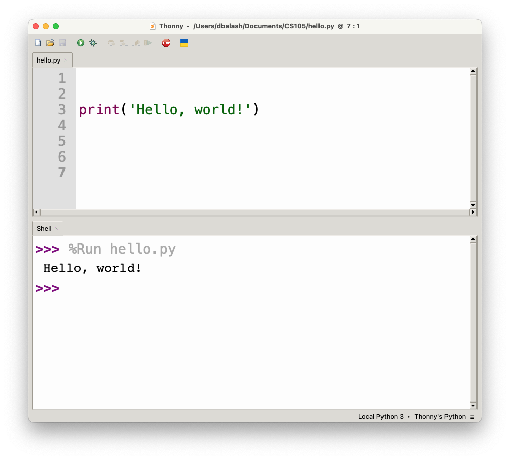

# Module 1: Your First Program

* First read this page then start coding the module.
* Post your Python files to Blackboard under the module 1 assignment.


### Objectives

Experience writing a really simple program.  


## Hello World in Python 

Here is the classic Hello World program in Python:

__hello.py__
 ```Python
print("Hello World!")
 ```

This is a simple program written in the Python programming language, possibly one of the smallest programs one can write, and a traditional starting point for learning programming.

Let's point out a few things:
* What we see above is the _text_ of the program.
	* The sequence of letters `print("Hello World!") is the program
	* When you type it in, it may look different (in color, fonts), and that's fine
* The entire program will appear inside of a _code editor_ when we write.
* We could use one of several code editors.
* This is how it would look inside the _Thonny_ code editor:



* Various editors colorize in different ways for convenience of reading, none of which affect the actual text of the program.

* Apart from typing it in, you have to _run the program_.

* Intuitively, just looking at the program we might think that:
	* It has to do with some kind of "printing" because we see `print`

* There are several ways to run a program: 
	* Run the program inside the very same editor used to type the program.
	* Run it without any editor.

* In _Thonny_ you can press the green "_play_" button to run the program. 

* The result of any printing appears in the shell tab. 

* Try this yourself. 

* Save the program as `hello.py`.

* Later we will attach this file to your assignment submission on Blackboard.

#### What's with printing the phrase "Hello World!"

It's a tradition in computer science that your first program will print "Hello World!"

It's meant to pretend that a program is a creature that's itself communicating to the outside world by saying hello.


## Hello World Variation

We will now spend a bit of time trying a few variations, and also examining what happens when typing mistakes are made.

Consider this program:

__helloname.py__
```Python
print("Hello World!")
print("My name is X")
```

* Open a new file in the _Thonny_ editor.

* Type up this program but use your own name instead of X.

* Run the program. 

* Save the program as `helloname.py`.

* Later we will attach this file to your assignment submission on Blackboard.


## What happens when things go (even slightly) wrong

We'll now deliberately make a few tiny errors and see what happens:

##### Error #1: forgetting to type the closing parenthesis.

__error1.py__
```Python
print("Hello World!"
```

Note the missing right parenthesis at the end of the line.

* What happens when we nonetheless try and run the program?

* Run the program. 

* Save the program as `error2.py`.

* Later we will attach this file to your assignment submission on Blackboard.


##### Error #2: What happens if we forget the quotation marks?

__error2.py__
```Python
print(Hello World!)
```

* What happens when we nonetheless try and run the program?


* Run the program. 

* Save the program as `error2.py`.

* Later we will attach this file to your assignment submission on Blackboard.


## Submission Instructions

Attach the files `hello.py`, `helloname.py`, `error1.py`, and `error2.py` to the Module 1 assignment on blackboard and submit the assignment. 


___


  
