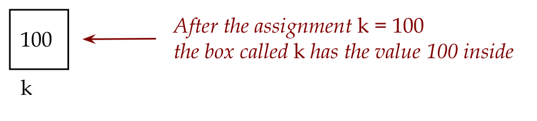

# Module 12: Lists

* First read this page then start coding the module.
* Post your Python files to Blackboard under the Module 12 assignment.

**Note:** Create a text file called `module12.txt` where you will store you answers to exercise questions. The questions that are not related to changing code. You will submit this file on Blackboard along with your code. 

## Objectives

By the end of this module you will be able to:
* Understand how a list is different from a variable
* Explore the syntax around using lists in programs
* Use lists in programs to solve problems
* Practice mental execution (tracing) and debugging related to lists


## An example of a list

Consider this program:

```python
# List example:
A = [1, 4, 9, 16, 25]

for i in range(5):
    print(A[i])

# In contrast, a plain variable:
k = 100
print(k)
    
```    
 
--- 
**Exercise: 1** In `my_list1.py`, type up the above and examine the output. Then, inside the above for-loop, but before the first print statement, add an additional line of code to also print the value of `i` so that each value of `i` is printed on a line by itself. Report your output in `module12.txt` and submit this modified version of `my_list1.py`.

---

Remember how we think of a variable as a box that stores values?

* This is indeed how we think of the variable `k` above.



* In contrast, a list _variable_ is a single name given to a collection of boxes:


* The above collection has a current _size_, in this case 5.
* The values in a list are called _elements_ of the list.
* There is an implied order going from the first to the last element.
* It turns out, we can access individual elements in the list using _indices_:


Important:
* List indices start at 0
* And end at _one less than the size_.
* Thus, in the above example, the size of the list is 5.
* The indices (positions in the list) are: 0, 1, 2, 3, 4.
* The last valid position (or index), which is 4 here, is one less than the size, 5.


Consider this program:

```python
A = [1, 4, 9, 16, 25]

# Use len to get the current size:
n = len(A)
print('Size of A: ', n)

# Add an element to the list:
A.append(36)
n = len(A)
print('Size of A: ', n)

# Change a particular element:
A[3] = 100
print('The list: ', n)
```

--- 
**Exercise: 2** Try out the above in `my_list2.py`.
 
--- 

Let's point out:

* Observe how we obtain the current size and add an element:

```python
A = [1, 4, 9, 16, 25]

# The result of calculating the size (length)
# is placed in variable n
n = len(A)
print('Size of A: ', n)

# We're now going to put the (new) number 36 at 
# the end of the list A using append
# Notice how: using A.append()
A.append(36)  
n = len(A)   # The new length will be 6
print('Size of A: ', n)

# The 4th element in the list is A[3]
A[3] = 100
print('The list: ', n)
```

* Next, observe square brackets being used for different purposes:

```python
# Square brackets for defining a list with elements
A = [1, 4, 9, 16, 25]

n = len(A)
print('Size of A: ', n)

A.append(36)  
n = len(A) 
print('Size of A: ', n)

# Square brackets for accessing a particular  
# element within the list
A[3] = 100
print('The list: ', n)
```

* We could use a variable to access elements, as long as that variable has an integer value that has a valid index, for example:
    ```python
    k = 3
    A[k] = 100
    ```  

* Remember `len`?

    * We had used `len` earlier for the length of strings, as in
        ```python
        s = 'hello'
        print(len(s))    # Prints 5
        ```
  
    * Here, `len` works to give us the length of a list, as in:
        ```python
        A = [1, 4, 9, 16, 25]
        print(len(A))
        ```
  
* For example:
    ```python
    A = [1, 4, 9, 16, 25]

    i = 3        # i's value 3 is valid for a size 5 list
    print(A[i])

    i = 7        # 7 is not valid
    print(A[i])
    ```
    
* In the above example, there is no element `A[7]` in a list that only has 5 elements.
 
--- 
**Exercise: 3** Type up the above in `my_list3.py`. Describe the error in your `module12.txt` file.
 
--- 
**Exercise: 4** In `my_list4.py`, make a list with the values 1,2,3,4,5,6,7,8,9,10. Then, set up a for-loop so that only the odd numbers are printed as in:
```
1
3
5
7
9
```

---