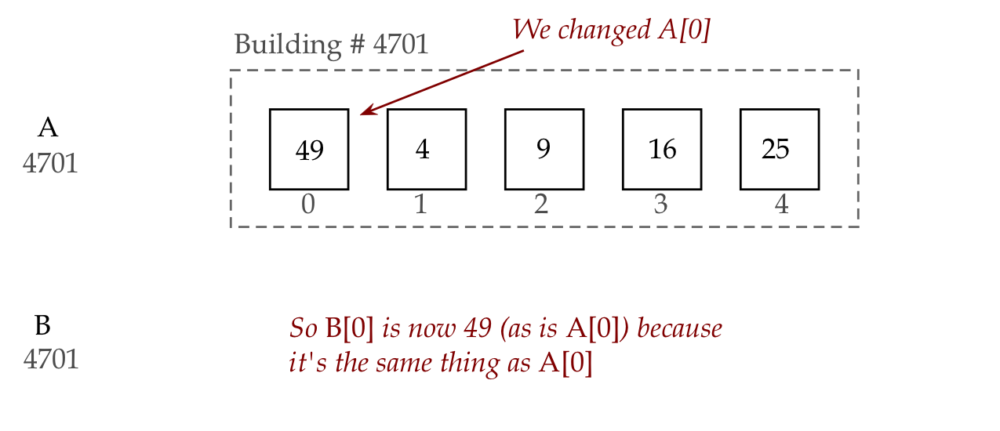

# Module 12: Lists

* First read this page then start coding the module.
* Post your Python files to Blackboard under the Module 12 assignment.

**Note:** Create a text file called `module12.txt` where you will store you answers to exercise questions. The questions that are not related to changing code. You will submit this file on Blackboard along with your code. 

## Objectives

By the end of this module you will be able to:
* Understand how a list is different from a variable
* Explore the syntax around using lists in programs
* Use lists in programs to solve problems
* Practice mental execution (tracing) and debugging related to lists


## An example of a list

Consider this program:

```python
# List example:
A = [1, 4, 9, 16, 25]

for i in range(5):
    print(A[i])

# In contrast, a plain variable:
k = 100
print(k)
    
```    
 
--- 
**Exercise: 1** In `my_list1.py`, type up the above and examine the output. Then, inside the above for-loop, but before the first print statement, add an additional line of code to also print the value of `i` so that each value of `i` is printed on a line by itself. Report your output in `module12.txt` and submit this modified version of `my_list1.py`.

---

Remember how we think of a variable as a box that stores values?

* This is indeed how we think of the variable `k` above.


* In contrast, a list _variable_ is a single name given to a collection of boxes:


* The above collection has a current _size_, in this case 5.
* The values in a list are called _elements_ of the list.
* There is an implied order going from the first to the last element.
* It turns out, we can access individual elements in the list using _indices_:


Important:
* List indices start at 0
* And end at _one less than the size_.
* Thus, in the above example, the size of the list is 5.
* The indices (positions in the list) are: 0, 1, 2, 3, 4.
* The last valid position (or index), which is 4 here, is one less than the size, 5.


Consider this program:

```python
A = [1, 4, 9, 16, 25]

# Use len to get the current size:
n = len(A)
print('Size of A: ', n)

# Add an element to the list:
A.append(36)
n = len(A)
print('Size of A: ', n)

# Change a particular element:
A[3] = 100
print('The list: ', n)
```

--- 
**Exercise: 2** Try out the above in `my_list2.py`.
 
--- 

Let's point out:

* Observe how we obtain the current size and add an element:

```python
A = [1, 4, 9, 16, 25]

# The result of calculating the size (length)
# is placed in variable n
n = len(A)
print('Size of A: ', n)

# We're now going to put the (new) number 36 at 
# the end of the list A using append
# Notice how: using A.append()
A.append(36)  
n = len(A)   # The new length will be 6
print('Size of A: ', n)

# The 4th element in the list is A[3]
A[3] = 100
print('The list: ', n)
```

* Next, observe square brackets being used for different purposes:

```python
# Square brackets for defining a list with elements
A = [1, 4, 9, 16, 25]

n = len(A)
print('Size of A: ', n)

A.append(36)  
n = len(A) 
print('Size of A: ', n)

# Square brackets for accessing a particular  
# element within the list
A[3] = 100
print('The list: ', n)
```

* We could use a variable to access elements, as long as that variable has an integer value that has a valid index, for example:
    ```python
    k = 3
    A[k] = 100
    ```  

* Remember `len`?

    * We had used `len` earlier for the length of strings, as in
        ```python
        s = 'hello'
        print(len(s))    # Prints 5
        ```
  
    * Here, `len` works to give us the length of a list, as in:
        ```python
        A = [1, 4, 9, 16, 25]
        print(len(A))
        ```
  
* For example:
    ```python
    A = [1, 4, 9, 16, 25]

    i = 3        # i's value 3 is valid for a size 5 list
    print(A[i])

    i = 7        # 7 is not valid
    print(A[i])
    ```
    
* In the above example, there is no element `A[7]` in a list that only has 5 elements.
 
--- 
**Exercise: 3** Type up the above in `my_list3.py`. Describe the error in your `module12.txt` file.
 
--- 
**Exercise: 4** In `my_list4.py`, make a list with the values 1,2,3,4,5,6,7,8,9,10. Then, set up a for-loop so that only the odd numbers are printed as in:
```
1
3
5
7
9
```

---

## More list examples
 
Just as we can add elements to list, so can we remove elements, as in:

```python
A = [64, 9, 25, 81, 49]
print(A)

A.remove(9)
print(A)
```    
 
---
**Exercise: 5**  Confirm the output by typing up the above in `my_list5.py`. Then, explore what would go wrong if you try and remove something that's not in the list. For example, change the line `A.remove(9)` to `A.remove(10)`. Report what you see in your `module12.txt` file. Submit your `my_list5.py` with the former (`A.remove(9)`).
 
--- 

Note:

* The elements in a list do not need to be in sorted order, as the above example shows. They can be in any order, but once in that order, they stay in that order unless we make a change to the elements in the list.
* Although our examples so far have lists of integers like 64, we will later build lists with real numbers and strings.
 
Consider this example:

```python
# List constructed by typing the elements in:
A = [1, 4, 9, 16, 25]
print(A)

# List built using code to construct elements:
B = []                 # An empty list
for i in range(5):
    k = (i + 1) * (i + 1) 
    B.append(k)
print(B)
```    
 
---  
**Exercise: 6** Type up the above in `my_list6.py`. Then, in your `module12.txt`, trace through the changing values of `i`, `k` and the list `B` in each iteration of the for-loop.

---
 

Note:

* It is possible to create an empty list and give it a variable name as in:
    ```python
    B = []                 # An empty list
    ```  
* We could then add elements by appending.
* One can shorten the lines inside the loop:
    ```python
    B = []                 # An empty list
    for i in range(5):
        B.append( (i + 1) * (i + 1) )
    ```
  
* Here, we've fed the arithmetic expression `(i + 1) * (i + 1)` directly into append, without using a separate variable `k` to first calculate and then append.
 
---  
**Exercise: 7**  In `my_odd_list.py` fill in the necessary code below to create a list with the first `N` odd numbers:

```python
N = 10
odd_numbers = []

# WRITE YOUR CODE HERE

print(odd_numbers)
```
  
In this case, the output should be:

```
[1, 3, 5, 7, 9, 11, 13, 15, 17, 19]
```

(These are the first 10 odd numbers).

--- 

We do not need to traverse in exactly the order of elements in the list:

* For example:
    ```python
    A = [15, 25, 35, 45, 55, 65, 75, 85, 95, 105]

    for i in range(9, 0, -2):
        print(A[i])
    ```

* Here, we're starting at the last element, traversing the list from end to beginning in steps of 2.
 
--- 
**Exercise: 8** Trace through the above code showing the values of `i` and `A[i]` at each iteration. Confirm by typing your code in `my_list7.py`.
 
---

## A strange thing with lists

Let's first look at copying between regular variables, as in:

```python 
x = 5

y = x     # Copy the value in x into y

x = 6     # Change the value in x

print(y)  # Does it affect what's in y?
``` 

---
**Exercise: 9** Consider the example above. In your `module12.txt`, draw two boxes, one for `x` and one for `y`. Show the contents of the two boxes and if they change, show how they change.

--- 

Next, consider this:

```python
A = [1, 4, 9, 16, 25]

B = A

A[0] = 49    # Change some value in list A

print(B)     # Does it affect what's in list B?
```    
 
---
**Exercise: 10** Type up the above in `my_list_copy.py` to find out whether any values have changed in list B.

--- 

Let's explain:

* Clearly something strange is going on with lists.
* One way to think of it is to go back to our picture of a list:


* We'll now sketch out an analogy:
* Think of the list as a _building_ with rooms (the boxes):

    * Then, the list variable `A` is really something that holds the building address (the building number).
    * The rooms in the building are numbered from 0, 1, etc.
    * The first room is `A[0]`, the second is `A[1]` etc.
* Now, consider an assignment like:
```python
B = A
```
  
Then, in the building analogy, what we get is:


* This is why, when we change the A list as in
```python
A[0] = 49    # Change some value in list A
```

Then, we are achieving



* Note: nowhere in our code is the building number (4701) explicitly written. Building numbers (they are technically called pointers) are handled by Python, and made invisible to us because we don't need them.
(Yes, we can print the building number if we wish, but that's an advanced topic.)
* We obviously want to know: is it possible to create a complete copy of `A` in `B`? As in:


* Because then, if we change `A`, it does not affect `B`:


* This is what it looks like in code:

```python
A = [1, 4, 9, 16, 25]

B = A.copy()

A[0] = 49    # Change some value in list A

print(B)     # Does it affect what's in list B?
```

--- 
**Exercise: 11** Type up the above in `my_list_copy2.py` to find out if any values have changed in list `B`.

---


So, which `(B = A or B = A.copy())` do we use?

* Generally, you should use `A.copy()` unless you intentionally want the same "building number".

* In the former case, you have to be careful.


## Different ways of iterating through a list

Consider this example:

```python
A = [1, 3, 5, 7, 9]

total = 0
for i in range(5):
    total = total + A[i]

print(total)
```

--- 
**Exercise: 12** Type up the above in `my_total_example1.py`. In your `module12.txt`, trace through the values of `i` and total through each iteration of the loop.
 
--- 

Now let's look at two different ways of writing the same loop (we'll only show the loop part):

* The first one:
```python
for i in range(len(A)):
    total = total + A[i]
```

* Notice:
    * Instead of figuring out the length of a list by looking at the list, we can ask Python to compute the length and use that directly:
    ```python
    for i in range(len(A)):
        total = total + A[i]
    ```
    * This way, we don't need to track the length ourselves (if elements get added or removed).

* The second way is even better:
    ```python
    for k in A:
        total = total + k
    ```

* Here:
    * Here the iteration is directly over the contents of the list.
    * The variable `k` is not an index but takes on the actual values in the list.
    * With a list like
        ```python
        A = [1, 3, 5, 7, 9]

        total = 0
        for k in A:
            total = total + k
        ```
    * In the first iteration `k` is `1`, in the second `k` is `3`, in the third `k` is `5`, and so on.
    * So, naturally, these get added directly into the variable `total`.

* You can think of the first approach (using an index `i` and `A[i]`) as _index iteration_.
* The second (using the value directly), as _content iteration_.
* Which one should one use?
    * Prefer to use content-iteration, whenever you can.
    * In some cases, however, you'll find index iteration is useful, especially when you need the position where something occurs in the list.
 
--- 
**Exercise: 13** In `my_content_iteration.py`, use content-iteration to `print` the contents of the list `A` below:

```python
A = [2020, 2016, 2012, 2008, 2004, 2000]

# Write your code here:
```  

The output should be one number per line in the order that the numbers appear in the list.

---

## Working with multiple lists

Suppose we have two lists of the same length like this:

```python
A = [1, 4, 9, 16, 25]
B = [1, 3, 5, 7, 11]
```  

Let's examine different ways of performing addition on the elements.
 
First, let's add up the total of all 10 numbers:

```python
A = [1, 4, 9, 16, 25]
B = [1, 3, 5, 7, 11]

total = 0
for k in A:
    total = total + k

for k in B:
    total = total + k

print(total)
```    
 
--- 
**Exercise: 14** First, in your `module12.txt`, trace the values of `k` and total in each iteration of each loop. Type the above in `my_twolist1.py` to confirm.

---
 

Note:

* In the above case, we added all the numbers contained in both lists, to get a single number.
* Notice how natural it is to use content-iteration.
What if we want a third list whose elements are the additions of corresponding elements from each list?
```
       1    4    9    16    25
       1    3    5     7    11
       -----------------------
       2    7   14    23    36
```

* Here, the last row is a new (third) list.
 
* Let's write code to perform element-by-element addition:

```python
A = [1, 4, 9, 16, 25]
B = [1, 3, 5, 7, 11]

C = []
for i in range(5):
    element_total = A[i] + B[i]
    C.append(element_total)

print(C)
```    

---  
**Exercise: 15** First, in your `module12.txt`, trace the values of `i` and `element_total` in each iteration of the loop, and also show how the list `C` changes across the iterations. Type the above in `my_twolist2.py` to confirm. Print the list inside the loop, by adding a print statement right after the append occurs. (Submit your program with the added print statement.) Explain why, in this case, _index-iteration_ is a better choice than _content-iteration_.
 
--- 

## Moving elements around in a list

Consider a list like:

```python
A = [1, 4, 9, 16, 25]
```

Next, suppose we want to swap the elements in the 2nd and 4th positions within the same list (not creating a new list).
That is, we want to write code so that:

```python
A = [1, 4, 9, 16, 25]

# ... code to swap 2nd and 4th elements ...

print(A)

# Should print [1, 16, 9, 4, 25]
```

To achieve that:

```python
A = [1, 4, 9, 16, 25]

temp = A[1]
A[1] = A[3]
A[3] = temp

print(A)
```    
--- 
**Exercise: 16** In your `module12.txt`, trace through the execution above showing the values in temp and the list after each line executes. Then, do the same if the middle three lines were replaced by:

```python
A[1] = A[3]
A[3] = A[1]
```  

--- 
**Exercise: 17** Use the "temp" variable idea to perform a left-rotate of a list in `my_left_rotate.py`. Thus, given

```python
A = [1, 4, 9, 16, 25]
# ... your code here...

print(A)
# Should print [4, 9, 16, 25, 1]
```
 
Thus everything but the first element moves leftwards and the first element gets to the last place. Use a for-loop to move most (but not all) elements.

---

## Lists of strings, characters, or real numbers

We have thus far seen lists of integers. One can make a list of other kinds of elements.

For example:

```python
# A list of strings:
A = ['cats', 'and', 'dogs']
s = ''
for w in A:
    s += w
print(s)

# A way to extract the characters in a string into a list:
s = 'abcdef'
B = list(s)
print(B)

# Some real numbers:
C = [1.1, 2.22, 3.333, 4.4444]
total = 0
for x in C:
    total = total + x
print('Average =', total / 4)
```    

--- 
**Exercise: 18** Type the above in `my_other_lists.py`, while noticing the subtle change in how the last print statement is written. Insert spaces in the first loop so that the first thing printed is cats and dogs.

---

## Random selection of elements from a list
 
It is often useful to be able to pick random elements from a list.

Let's use this feature first for a single roll of a die, and then two dice:

* Since a single die has 6 faces with the numbers 1 through 6, we'll use a list of the numbers 1 through 6:
    ```python
    die = [1, 2, 3, 4, 5, 6]
    ```
* Our goal is to choose one of these numbers randomly.
* Python provides a way to randomly pick (without removing) an element from a list:
    ```python
    die = [1, 2, 3, 4, 5, 6]
    roll = random.choice(die)
    ```  
* Let's put this together into a program (remembering to `import` the `random` package):

```python
# import the random package
import random

# Setup a list named die, with six numbers (six sided)
die = [1, 2, 3, 4, 5, 6]

# Use the random choice function to 
# randomly choose an item from the list
roll = random.choice(die)

print(roll)
```    

--- 
**Exercise: 19** Type the above in `my_die_roll.py`. Run the program several times to see that you are getting random selections from the list.
 
--- 

Next, let's use this to make a (ridiculously) simple game:

* Two players each roll a die N times. The numbers on the rolls are averaged. The player with the higher average wins.
* OK, not the most entertaining game, but one for which we can easily write a program (from the point of view of one player):

```python
import random

die = [1, 2, 3, 4, 5, 6]

num_trials = 10
total = 0
for i in range(num_trials):
    roll = random.choice(die)
    print(roll)
    total += roll

print('Average score:', total / num_trials)
```    

--- 
**Exercise: 20** Type the above in `my_die_roll2.py` to observe the result. Report in your `module12.txt` the average when you use a large number of trials (say, 1000).
 
---

## When things go wrong
 
In each of the exercises below, first try to identify the error just by reading. Then type up the program to confirm, and after that, fix the error.
 

--- 
**Exercise: 21**

```python
A = [1, 2, 3, 4, 5, 6, 7, 8, 9, 10]
for i in range(1, 10):
    print(A[i])
```

Identify and fix the error in `my_error1.py`.
 
--- 
**Exercise: 22** The following program intends to build the decreasing-order list `[10, 9, 8, 7, 6, 5, 4, 3, 2, 1]`.

```python
A = []
n = 10
for i in range(n):
    n = n - 1
    A.append(n)

print(A)
```

Identify and fix the error in `my_error2.py`.
 
--- 
**Exercise: 23** The following program intends to add to `N` all the elements of the list `A`.

```python
N = 100
A = [1, 4, 9, 16, 25]

for k in A:
    N = N + A[k]

print(N)
```

Identify and ix the error in `my_error3.py`.

--- 


