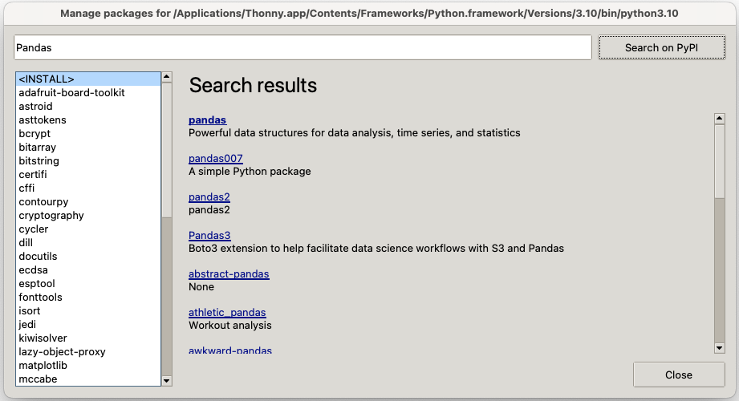

# Module 16: Introduction to Pandas

* First read this page then start coding the module.  
* Post your Python files to Blackboard under the Module 16 assignment.  

---

## Objectives

By the end of this module, you will be able to:  
* Understand what Pandas is and why it's useful.  
* Load data from a CSV file using Pandas.  
* Perform basic data exploration and summary statistics.  
* Visualize data using Pandas and Matplotlib.  

---

## What is Pandas?

Pandas is a Python library used for data manipulation and analysis. It provides powerful tools to work with structured data, such as tables, spreadsheets, or databases.

### Importing Pandas

You need to import Pandas before using it. The most common way is:

```python
import pandas as pd
```

Use Thony to install the Matplotlib library on your machine.




---
## Download the Data File


Download the file bikeshare.csv and put it in the folder where you save your Python programs.
[https://raw.githubusercontent.com/cmsc105-f24/code/refs/heads/main/bikeshare.csv](https://raw.githubusercontent.com/cmsc105-f24/code/refs/heads/main/bikeshare.csv)


The original source of the bike-sharing data is Capital Bikeshare [https://ride.capitalbikeshare.com/system-data](https://ride.capitalbikeshare.com/system-data).


#### Hourly Data

This dataset is no different from many other datasets that you’ve probably seen before: a rectangular array of rows and columns. In this dataset, each row represents information about a particular hour between midnight on January 1, 2011, and 11:59 PM on December 31, 2012—more than 17,000 hours total. The rows are arranged in order, so the first few rows give us information about the first few hours of 2011, and the last few rows relate to the last few hours of 2012.

Each column contains a particular metric that has been measured for each of these hours. For example, the windspeed column gives us hourly measurements of wind speed at a particular weather-recording station in Washington, DC. Notice that this measurement isn’t in familiar units like miles per hour. Instead, the measurements have been transformed so that they’re always between 0 and 1; all we need to know is that 1 represents a fast wind speed and 0 represents no wind. If you look at the first few rows, you’ll see that the windspeed value is 0 for each of these rows, meaning there was no measured wind for the first few hours of the bike-sharing service’s existence. On the seventh row (counting the heading as the first row), you can see that there was finally some wind, and its measured speed was 0.0896. If you look at the hr column, you can see that this wind was recorded when hr = 5, or at 5 AM. We know that this row gives us information about January 1 because the dteday column on the seventh row has the value 2011-01-01.


## Loading a CSV File

The primary data structure in Pandas is a **DataFrame**, which you can think of as a table of rows and columns.

Consider the file `bikeshare.csv` with the following content:

```
instant,dteday,season,yr,mnth,hr,holiday,weekday,workingday,weathersit,temp,atemp,hum,windspeed,casual,registered,count
1,2011-01-01,1,0,1,0,0,6,0,1,0.24,0.2879,0.81,0,3,13,16
2,2011-01-01,1,0,1,1,0,6,0,1,0.22,0.2727,0.8,0,8,32,40
3,2011-01-01,1,0,1,2,0,6,0,1,0.22,0.2727,0.8,0,5,27,32
4,2011-01-01,1,0,1,3,0,6,0,1,0.24,0.2879,0.75,0,3,10,13
5,2011-01-01,1,0,1,4,0,6,0,1,0.24,0.2879,0.75,0,0,1,1
6,2011-01-01,1,0,1,5,0,6,0,2,0.24,0.2576,0.75,0.0896,0,1,1
7,2011-01-01,1,0,1,6,0,6,0,1,0.22,0.2727,0.8,0,2,0,2
8,2011-01-01,1,0,1,7,0,6,0,1,0.2,0.2576,0.86,0,1,2,3
9,2011-01-01,1,0,1,8,0,6,0,1,0.24,0.2879,0.75,0,1,7,8
10,2011-01-01,1,0,1,9,0,6,0,1,0.32,0.3485,0.76,0,8,6,14
11,2011-01-01,1,0,1,10,0,6,0,1,0.38,0.3939,0.76,0.2537,12,24,36
12,2011-01-01,1,0,1,11,0,6,0,1,0.36,0.3333,0.81,0.2836,26,30,56
13,2011-01-01,1,0,1,12,0,6,0,1,0.42,0.4242,0.77,0.2836,29,55,84
14,2011-01-01,1,0,1,13,0,6,0,2,0.46,0.4545,0.72,0.2985,47,47,94
15,2011-01-01,1,0,1,14,0,6,0,2,0.46,0.4545,0.72,0.2836,35,71,106
16,2011-01-01,1,0,1,15,0,6,0,2,0.44,0.4394,0.77,0.2985,40,70,110
17,2011-01-01,1,0,1,16,0,6,0,2,0.42,0.4242,0.82,0.2985,41,52,93
18,2011-01-01,1,0,1,17,0,6,0,2,0.44,0.4394,0.82,0.2836,15,52,67
19,2011-01-01,1,0,1,18,0,6,0,3,0.42,0.4242,0.88,0.2537,9,26,35
20,2011-01-01,1,0,1,19,0,6,0,3,0.42,0.4242,0.88,0.2537,6,31,37
21,2011-01-01,1,0,1,20,0,6,0,2,0.4,0.4091,0.87,0.2537,11,25,36
22,2011-01-01,1,0,1,21,0,6,0,2,0.4,0.4091,0.87,0.194,3,31,34
23,2011-01-01,1,0,1,22,0,6,0,2,0.4,0.4091,0.94,0.2239,11,17,28
24,2011-01-01,1,0,1,23,0,6,0,2,0.46,0.4545,0.88,0.2985,15,24,39
25,2011-01-02,1,0,1,0,0,0,0,2,0.46,0.4545,0.88,0.2985,4,13,17
```

To load this file into a DataFrame, use the following code:

```python
import pandas as pd

# Load the CSV file
df = pd.read_csv('bikeshare.csv')

# Display the first 5 rows of the DataFrame
print(df.head())
```

The `pd.read_csv` function reads the file into a DataFrame, and `df.head()` displays the first 5 rows.

---

### **Exercise 1**

In a file named `load_csv.py`, write a program that:  
1. Reads the `bikeshare.csv` file into a Pandas DataFrame.  
2. Prints the first 5 rows of the DataFrame.  

---

## Exploring the Data

Pandas provides functions to explore and summarize your data. For example:

```python
import pandas as pd

# Load the CSV file
df = pd.read_csv('bikeshare.csv')

# Display column names
print("Columns:", df.columns)

print("\n\n") # Add two blank lines

# Show data types of each column
print("Data Types:\n", df.dtypes)

print("\n\n") # Add two blank lines

# Get summary statistics for numeric columns
print("Summary Statistics:\n", df.describe())
```

---

### **Exercise 2**

In a file named `explore_data.py`, write a program that:  
1. Prints the column names of the DataFrame.  
2. Displays the summary statistics.  

---

## Filtering and Selecting Data

You can filter rows and select specific columns using Pandas. For example:

```python
import pandas as pd

# Load the CSV file
df = pd.read_csv('bikeshare.csv')

# Filter rows where the hour (hr) is 12
noon_data = df[df['hr'] == 12]

# Select only the 'temp' and 'count' columns
temp_count = df[['temp', 'count']]

print("Data for noon:\n", noon_data)
print("Temperature and count columns:\n", temp_count)
```

---

### **Exercise 3**

In a file named `filter_data.py`, write a program that:  
1. Filters the DataFrame to include only rows where `weathersit` is 1.  
2. Displays the `temp`, `hum`, and `count` columns of these filtered rows.  

---

## Calculating Specific Summary Statistics

Pandas provides many built-in methods to calculate statistical measures for your data. For example:

```python
import pandas as pd

# Load the CSV file
df = pd.read_csv('bikeshare.csv')

# Calculate specific statistics
print("Mean count of rentals:", df['count'].mean())
print("Median count of rentals:", df['count'].median())
print("Standard deviation of count:", df['count'].std())
print("Minimum registered rentals:", df['registered'].min())
print("Maximum registered rentals:", df['registered'].max())
```

These functions are applied to specific columns (e.g., `count`, `registered`) and return the requested statistic.

---

### **Exercise 4**

In a file named `summary_statistics.py`, write a program that:  
1. Loads the `bikeshare.csv` file into a Pandas DataFrame.  
2. Prints the following:
   - Mean of the `count` column.
   - Median of the `count` column.
   - Standard deviation of the `count` column.
   - Minimum value of the `registered` column.
   - Maximum value of the `registered` column.

---

## Plotting Data with Pandas and Matplotlib

Pandas integrates well with Matplotlib for visualization. For example:

```python
import pandas as pd
import matplotlib.pyplot as plt

# Load the CSV file
df = pd.read_csv('bikeshare.csv')

# Plot temperature vs. count
plt.scatter(df['temp'], df['count'])
plt.xlabel('Temperature')
plt.ylabel('Count')
plt.title('Temperature vs. Count')
plt.show()
```

---

### **Exercise 5**

In a file named `plot_data.py`, write a program that:  
1. Plots the `count` of bikes rented for each `hr` using a scatter chart.  
2. Adds labels and a title to the chart.  

---


