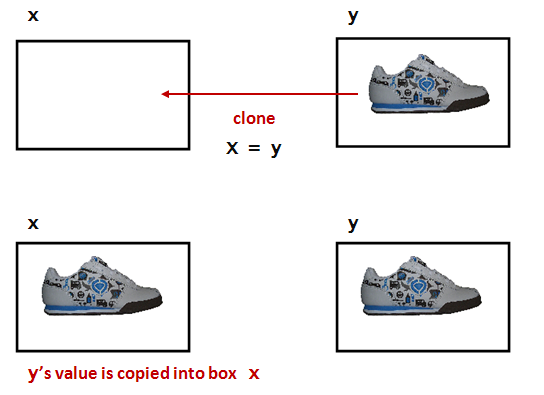

# Module 3: Integers

* First read this page then start coding the module.
* Post your Python files to Blackboard under the Module 3 assignment.

**Note:** Create a text file called `module3.txt` where you will store you answers to exercise questions. The questions that are not related to changing code. You will submit this file on Blackboard along with your code. 

## Objectives

By the end of this module you will be able to:
* Create variable declarations.
* Assign values to variables by simple assignment, and print them out.
* Distinguish between integers in strings versus actual integers.
* Demonstrate ability to perform operations on integers for a desired output.
* Simplify expressions with constants to single value.
* Evaluate expressions with variables in them.
* Convert English descriptions of operations into expressions.
* Mentally trace execution with expressions and calculations.


## First, an analogy

Suppose we have boxes. Consider the following rules about "boxes":

* Each box can store only one item.


* The possible things that can be stored inside are called values.
* Thus, at any given moment, a box's value is whatever's inside it.
* Each box has a unique _name_:


There is a _cloning_ process that works like this:



* The value inside one box is cloned.
* The cloned value is placed inside another.

* There is a strange shortcut notation to specify cloning:

**x = y**


* Here, the = (equals sign) does NOT mean "equals."
* It has been repurposed to mean "clone", "copy," or, in programming-language jargon, "assign".

* How to say it: **"x is assigned the value in y"**.


* **Important:** Remember, a box can hold only one value at a time.
* The technical term for our informal "box" is __variable__.


## Integer Variables

We'll now start working with "boxes" (variables) that hold _integers_ (whole numbers like 3, 17, 2097, but not numbers like 3.141).

Consider this program:

```python
i = 5
print(i)
```

---
**Exercise 1:** Type up the program in `my_variable_example.py`. Also save the file so that it can be submitted on Blackboard. What does it print? Report what you see in `module3.txt`.

---


Now let's examine key parts of this program:

* First, `i` is the _name_ of a "box" (of sorts).
* The term used for "box" is _variable_.
    * `i` is a variable.
* To put something in a variable, we use _assignment_
    * with the repurposed = (equals) sign.

    ```python
    # i is the name of the variable 
    # that we've created

    i = 5  # 5 is the value that we're 
           # placing inside the variable i

    print(i)
    ```

* When we print a variable, what gets printed is its _value_.
    * Thus, the number 5 gets printed

    ```python
    i = 5
    print(i)  # The value inside i 
              # (in this case, 5) gets printed
    ```

* **Important:** What you see on printed out is the number 5 and NOT the letter i
* Thus when you see `print(i)` you should think:
    * "Hmmm, the `print` function is going to print the contents of variable `i`".
    * "I wonder what's inside `i`?"
    * "Let me look in the program to see what was the most recent value that got written into `i`".

* For example:

    ```python
    i = 5
    i = 3
    print(i) 
    ```

---
**Exercise 2:** Type up the above in `my_variable_example2.py` and confirm that 3 is what gets printed.

---

<br />

By way of explanation:

```python
i = 5
i = 3
print(i) # The most recent value of i (in this case, 3) gets printed
```

<br />

---
**Exercise 3:** Is it possible to not have a value in a variable? Consider this program:

```python
i
print(i)
```

Type up the program in `my_variable_example3.py` What is the error? Answer in module3.txt. (Remember, non-coding questions are to be answered in your module text file, in this case: `module4.txt`.)

---

Thus: when you make a variable, you need to put something in it.


Next, let's look at _assignment_ between variables:

* This is the analogue of cloning between "boxes".
* Consider this program:

    ```python
    i = 5
    j = i     # The value in i gets copied into j
    print(j)  # Prints 5
    ```

We say, in short, "`i` is assigned to `j`".

* Notice: we've used comments above to annotate and explain.
    * We'll do this often, knowing that comments are not executed.


---
**Exercise 4:** Consider this program:

```python
i = 5
j = i
print(j)
print(i)   # Did i lose its value?
```

Type up the program in `my_variable_example4.py` and report what gets printed in `module3.txt`.

---

<br />

The above example illustrates that the value in `i` gets copied into the variable `j`, which means that the value 5 is still in the variable `i`.

<br />

---
**Exercise 5:** Consider this program:

```python
i = 5
j = i
k = j
print(k)
```

Try to identify the output of this program just by mental execution. Next, type up the program in `my_variable_example5.py` and confirm.


---
**Exercise 6:** Consider this program:

```python
i = 5
j = i
i = 0
k = j
j = 0
print(k)
```

Try to identify the output of this program just by mental execution. Then type up the program in `my_variable_example6.py` and confirm.

---

Note that a copied value does not change if the original is changed:

* For example, consider:

    ```python
    i = 5
    j = i      # j now has 5
    i = 0      # We changed i here
    print(j)   # j still has 5
    ```

* Here's the line-by-line execution:
    * The first line puts the value 5 in variable `i`.
    * The second line copies the value in `i` (which is 5) into `j`. So `j` will have the value 5 as well.
    * The third line replaces the value 5 with value 0.
    * `j` still has 5, so the fourth line will print 5.

* Note: 0 is an actual value, and is not "no value" or "nothing".


---
**Exercise 7:** Type up the following lines of code in `my_variable_example7.py`:

```python
i = 5
j = 6      

# Add code between here

# and here.

print(i)   # should print 6
print(j)   # should print 5
```

Add some lines of code with the objective of __swapping__ the values in variables `i` and `j`. You will need a third variable to be used as a holding place. Thus, without directly assigning the number 5 to `j` or the number 6 to `i`, write code using a third variable to achieve the desired swapping of values.

---


## Integer Operators


Let's examine the familiar arithmetic operators `+`, `-`, `*`, `/`

* Addition: `+`
* Subtraction: `-`
* Multiplication: `*`
* Division: `/`

* Consider this example with addition:

    ```python
    i = 5
    j = 6
    k = i + j
    print(k)
    ```

* What happens during execution:
    * The values in `i` and `j` are added.
    * The resulting _value_ goes into variable `k`.
* A long-ish way of saying this aloud:
    * "`k` is assigned the sum of the values of `i` and `j`"
A shorter way:
    * "`k` is assigned `i` plus `j`"

* Here's an example with multiplication and division:
    ```python
    i = 5
    j = 6
    k = i * j
    print(k)      # prints 30
    m = i / j
    print(m)      # what does this print?
    n = i // j
    print(n)      # what does this print?
    ```
---
**Exercise 8:** Type up the above in `my_variable_example8.py`. What is the value of `n` printed? Change `i` to 21. What is the value of `n` printed? Answer in `module3.txt`. Submit your code with `i` set to 5.

---

Integer division:

* In math, we learned that $1/4 = 0.25$ and $21/6 = 3.5$.
* This remains true in Python when we do something like
    ```python
    i = 21
    j = 6
    m = i / j
    ```
  
* On the other hand, if we wish to perform integer division, we can use the integer division operator:
    ```python
    i = 21
    j = 6
    m = i // j
    ```

* That is, the result is truncated _down_ to the nearest integer.
    * Example: `3 // 2` becomes 1 because 1.5 gets truncated to 1.
    * Example: `15 // 4` becomes 3 because 3.75 gets truncated to 3.
* Integer division is useful when we want to do integer arithmetic.


## Expressions and operator-precedence

Consider the following program:

```python
i = 5
j = 6
k = i * j - (i + 1) * (j - 1)
print(k)
```

---
**Exercise 9:** Type up the above program in `my_expression_example.py` What does it print? Answer in module3.txt.

---

About expressions:

* An expression combines constants (like 1, above), and variables using operators.
* Example:
    ```python
    i * j - (i + 1) * (j - 1)
    ```
* The above expression is really equivalent to:
    ```python
    (i * j) - ((i + 1) * (j - 1))
    ```

    * Here, we added some clarifying parentheses.
* Operator _precedence_ allows us to reduce the number of clarifying parentheses.
* Python precedence follows standard precedence in math: `/`, `*`, `+`, `-`.
* You might remember the precedence via the acronyms BODMAS or PEMDAS. (Look it up.)
* The above expression is NOT the same as:
    ```python
    i * j - i + 1 * j - 1
    ```


Let's dive a bit deeper into precedence and do some examples:

* We'll use the four operators: add or `+`, subtraction or `-`, multiplication or `*`, and division or `/`.
* We'll use plain ol' numbers to illustrate.
* Note: The key to working them out is to use extra parentheses in the right way.

* The PEMDAS rule:
    * First apply Parentheses, then Exponents, then Multiplication and Division, and then Addition and Subtraction.
    * Example: `3 + 2*4`
    * Here, we apply `2*4` to give `8`
    * Then do `3 + 8` to give `11`.
    * Applying extra parenthesis to `3 + (2 * 4)` makes it clear.

* Example: `3*(24/3-2*3)`
    * First, work out what's inside the parens (the P of PEMDAS):
    * Do div to `24/3` and multiply to `2*3` to get `(8 - 6)`
    * This gives `(2)`
    * Now go out and see that we need to do `3*(2)`
    * Which gives `6`.
    * Using extra parens and spacing makes it clear: `3 * ( (24 / 3) - (2 * 3) )`

* Example: `1 + ( (4 - 1) * 8) / 6`
    * Do the innermost parens first: `(4 - 1) = 3`
    * Which results in `1 + (3 * 8) / 6`
    * Then the next parens to give: `1 + 24/6`
    * Then the D in PEMDAS: `1 + 4`
    * Result: `5`


---
**Exercise 10:** What does the expression `i*j - i+1*j-1` evaluate to when `i = 7` and `j = 3`? Answer in module3.txt.

---

## More expressions

The __remainder__ operator `%`:

* The expression `10 % 3` is "the remainder when 10 is divided by 3".
* Thus `10 % 3` is `1`.
* Similarly `11 % 4` is `3`.
* The remainder operator is sometimes called __modulo__, as in "ten modulo 3 is 1"


Consider this example:

```python
i = 14
j = -6
k = i % (-j)
print(k)
```

---
**Exercise 11:** Can you mentally execute and identify what's printed? Type up the above in `my_expression_example2.py` to confirm. Report the value in `module3.txt`.

---