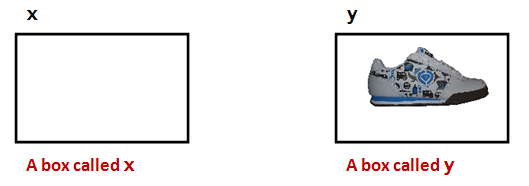

# Module 3: Integers

* First read this page then start coding the module.
* Post your Python files to Blackboard under the Module 3 assignment.

**Note:** Create a text file called `module3.txt` where you will store you answers to exercise questions. The questions that are not related to changing code. You will submit this file on Blackboard along with your code. 

## Objectives

By the end of this module you will be able to:
* Create variable declarations.
* Assign values to variables by simple assignment, and print them out.
* Distinguish between integers in strings versus actual integers.
* Demonstrate ability to perform operations on integers for a desired output.
* Simplify expressions with constants to single value.
* Evaluate expressions with variables in them.
* Convert English descriptions of operations into expressions.
* Mentally trace execution with expressions and calculations.


## First, an analogy

Suppose we have boxes. Consider the following rules about "boxes":

* Each box can store only one item.


* The possible things that can be stored inside are called values.
* Thus, at any given moment, a box's value is whatever's inside it.
* Each box has a unique _name_:



There is a _cloning_ process that works like this:


* The value inside one box is cloned.
* The cloned value is placed inside another.

* There is a strange shortcut notation to specify cloning:

**x = y**


* Here, the = (equals sign) does NOT mean "equals."
* It has been repurposed to mean "clone", "copy," or, in programming-language jargon, "assign".

* How to say it: **"x is assigned the value in y"**.


* **Important:** Remember, a box can hold only one value at a time.
* The technical term for our informal "box" is __variable__.


## Integer Variables

We'll now start working with "boxes" (variables) that hold _integers_ (whole numbers like 3, 17, 2097, but not numbers like 3.141).

Consider this program:

```python
i = 5
print(i)
```

---
**Exercise 1:** Type up the program in `my_variable_example.py`. Also save the file so that it can be submitted on Blackboard. What does it print? Report what you see in `module3.txt`.

---


Now let's examine key parts of this program:

* First, `i` is the _name_ of a "box" (of sorts).
* The term used for "box" is _variable_.
    * `i` is a variable.
* To put something in a variable, we use _assignment_
    * with the repurposed = (equals) sign.

```python
# i is the name of the variable that we've created
i = 5  # 5 is the value that we're placing inside the variable i
print(i)
```

* When we print a variable, what gets printed is its _value_.
    * Thus, the number 5 gets printed

```python
i = 5
print(i)  # The value inside i (in this case, 5) gets printed
```

* **Important:** What you see on printed out is the number 5 and NOT the letter i
* Thus when you see `print(i)` you should think:
    * "Hmmm, the `print` function is going to print the contents of variable `i`".
    * "I wonder what's inside `i`?"
    * "Let me look in the program to see what was the most recent value that got written into `i`".

For example:

```python
i = 5
i = 3
print(i) 
```

---
**Exercise 2:** Type up the above in `my_variable_example2.py` and confirm that 3 is what gets printed.

---

By way of explanation:

```python
i = 5
i = 3
print(i) # The most recent value of i (in this case, 3) gets printed
```


---
**Exercise 3:** Is it possible to not have a value in a variable? Consider this program:

```python
i
print(i)
```

Type up the program in `my_variable_example3.py` What is the error? Answer in module3.txt. (Remember, non-coding questions are to be answered in your module text file, in this case: `module4.txt`.)

---

Thus: when you make a variable, you need to put something in it.


